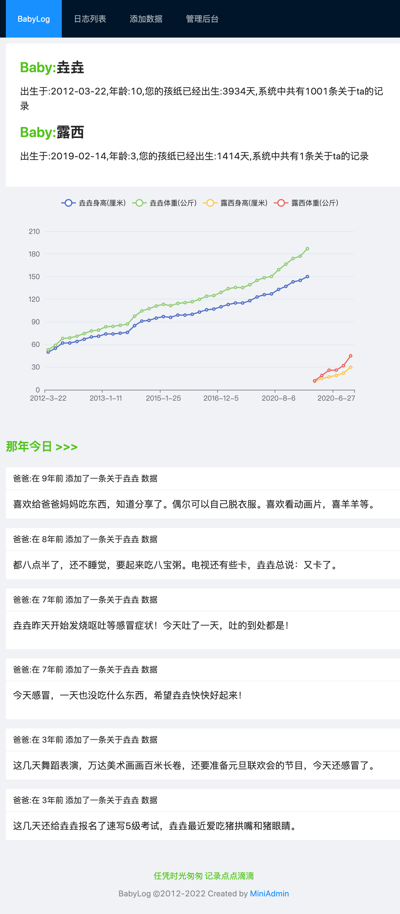
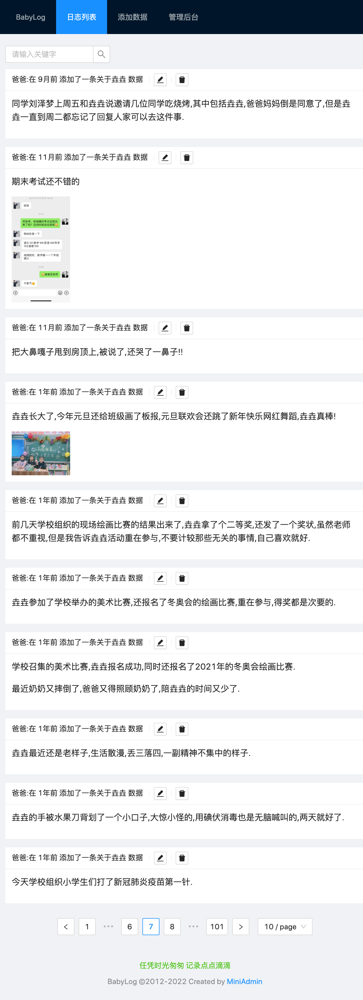
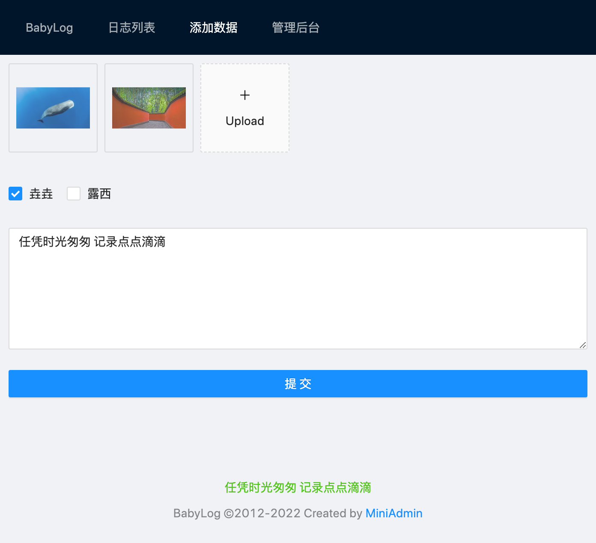
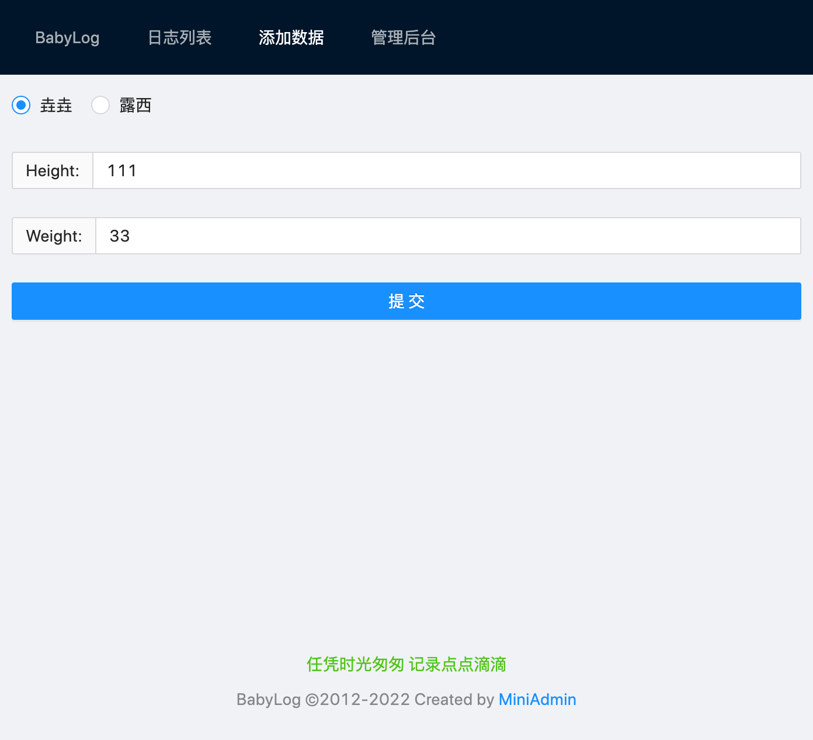

# BabyLog 2.0

岁月如风，唯有此忆, 任凭时光匆匆，记录点点滴滴。 

一晃10年都过去了,当初孩子出生的时候,我只是想记录一下一些当爸爸的心路历程,没想到一下子就过去了10年.

此间,程序重构过多次,但是唯一不变的就是那些记录下来的数据和相片.

全新的BabyLog2.0 发布了!

## 程序介绍

本程序在miniadmin框架的基础之上继续开发的.
技术栈:fastAPI、vue3、antDesign等

BabyLog是用来记录孩子成长过程的日记，那年今天,全文搜索等功能，还包括身高，体重，并使用图表展示,2.0系统支持多个宝贝.支持多位家长亲属共同记录.

## 界面预览

首页有一些孩子相关记录及那年今天的回忆类似QQ空间的那年今天

## 安装

1. git克隆或是下载压缩包。本程序测试环境为:`Python 3.10`,下载程序进入程序主目录，安装程序相关依赖，在程序根目录终端下运行：

    pip install -r requirements.txt -i https://mirrors.aliyun.com/pypi/simple/

然后:

    cd back
    python main.py

首次启动程序,会创建两个账号和两个宝宝,您可以根据需求进入后台管理进行数据的增删改.
账号:baba或mama 密码:123456  二个账号都是超级管理权限.登陆后台可以修改资料或密码,修改宝宝的名字和生日等资料.

## 写在最后

这个程序自己真的是使用了好多年，历经几次的重构，从最开始的php原生代码到使用thinkPHP框架，后来有使用Java重构了一次（详见分支master），期间还用Python写了一个终端的录入版，而后使用了flask重构了一下，这次2.0版本使用前后端分离,这个程序使用也有10年多了，回头看看真是感慨万千，一方面是孩子的记录，一方面是自己学习的渣渣历程。

真诚的希望有孩子的和打算生孩子的程序员们来一起维护这个程序，有些东西真的需要记下来，不然回头看去都是模糊的回忆。

任凭时光匆匆，记录点点滴滴。以上记录与2022-12-29
   

