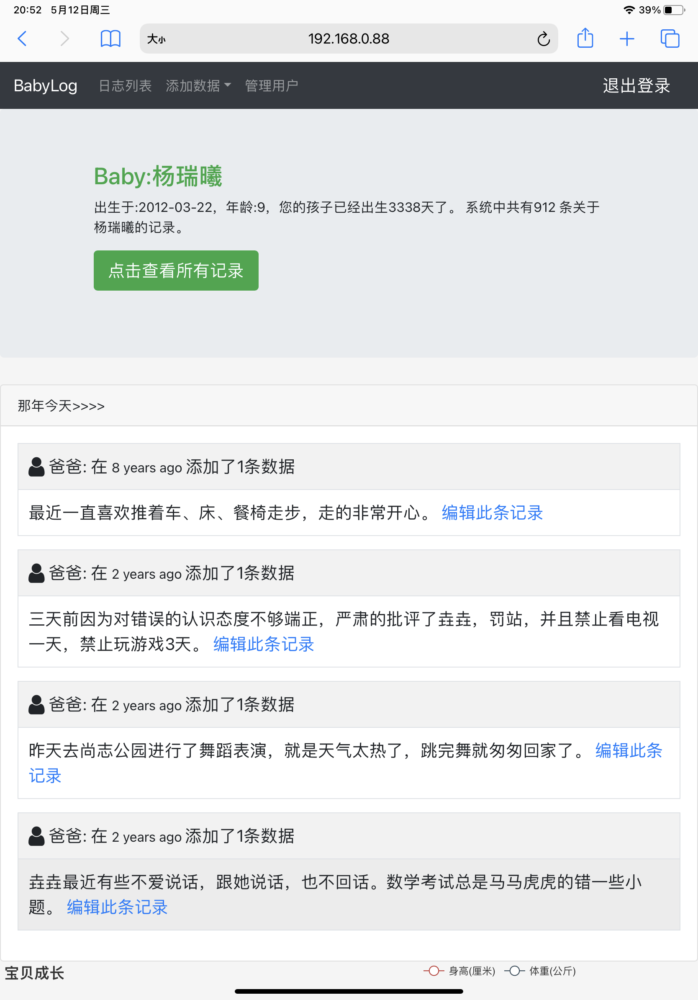
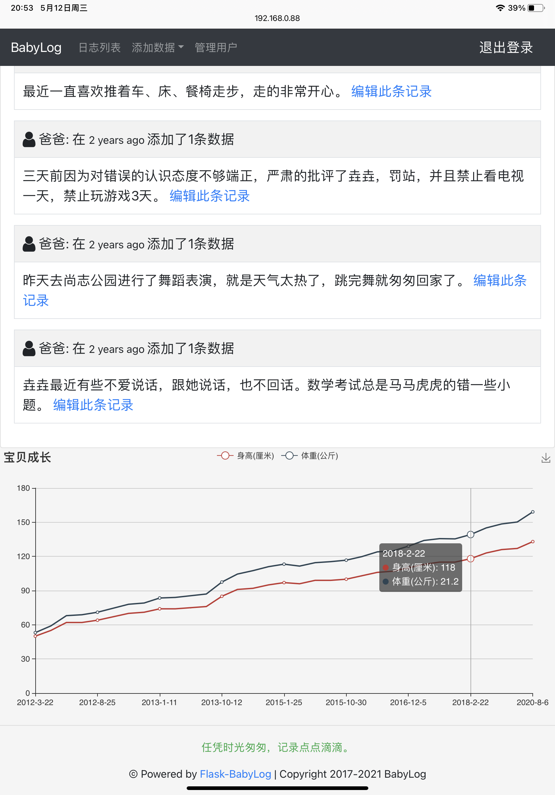
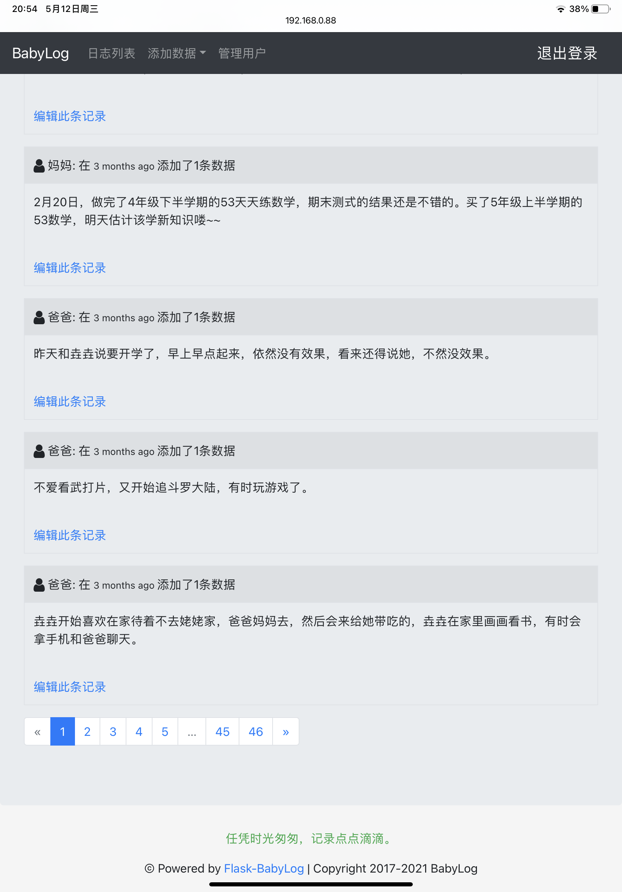
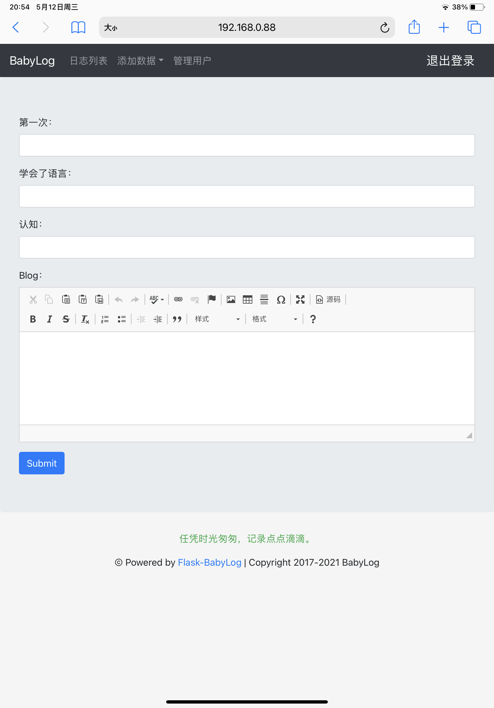

# BabyLog

岁月如风，唯有此忆, 任凭时光匆匆，记录点点滴滴。 

当爸爸了，就多陪陪孩子，有事没事的记些东西，不要总把心思放在程序编码上，也多陪陪孩子！

记录了那么多条数据，是时候也为孩子回忆做个数据，也许将来某一天你也会翻翻看看，重温那些旧时光和家人一起感慨怀念。

本人菜鸟一个，属于爱好者并非专业码农，程序有问题是难免的，烦请各位大佬多提意见。

## 程序介绍

本程序采用 Flask bootstrap sqlite 等框架技术支持。

BabyLog是用来记录孩子成长过程的日记，包括：日记，语言，认知，那年今天,全文搜索等功能，还包括身高，体重，并使用图表展示。

### 目前只支持一孩儿，多孩儿版稍后更新到另一个分支。

## 界面预览

首页有一些孩子相关记录及那年今天的回忆类似QQ空间的那年今天

首页下方有一个图表，用来展示孩子的身高体重。

日志列表支持关键字搜索，分页。

添加日志表单采用ckeditor支持上传照片

有一个简单的后台管理，可以编辑数据

## 安装

1. git克隆或是下载压缩包。
本程序测试环境为:`Python 3.8.8·
下载程序进入程序主目录，安装程序相关依赖，在程序根目录终端下运行：

    pip install -r requirements.txt

1. 安装完所有依赖库后，在程序主目录终端下运行`flask go`,创建数据库和表，并添加一个管理员`admin`,密码`8888`，添加一个baby，登录后可以在管理页面修改相关资料和密码。
2. 在程序主目录终端下运行`flask run`或`flask run -h 0.0.0.0 -p 80`，使用管理员`admin`,密码`8888`进行登录，登录后即可添加各种数据及修改资料。

## 写在最后

这个程序自己真的是使用了好多年，历经几次的重构，从最开始的php原生代码到使用thinkPHP框架，后来有使用Java重构了一次（详见分支master），期间还用Python写了一个终端的录入版，这次使用了flask重构了一下，这个程序使用也快10年了，回头看看真是感慨万千，一方面是孩子的记录，一方面是自己的学习历程。

真诚的希望有孩子的和打算生孩子的程序员们来一起维护这个程序，有些东西真的需要记下来，不然回头看去都是模糊的回忆。

任凭时光匆匆，记录点点滴滴。以上记录与2021-05-12
   

