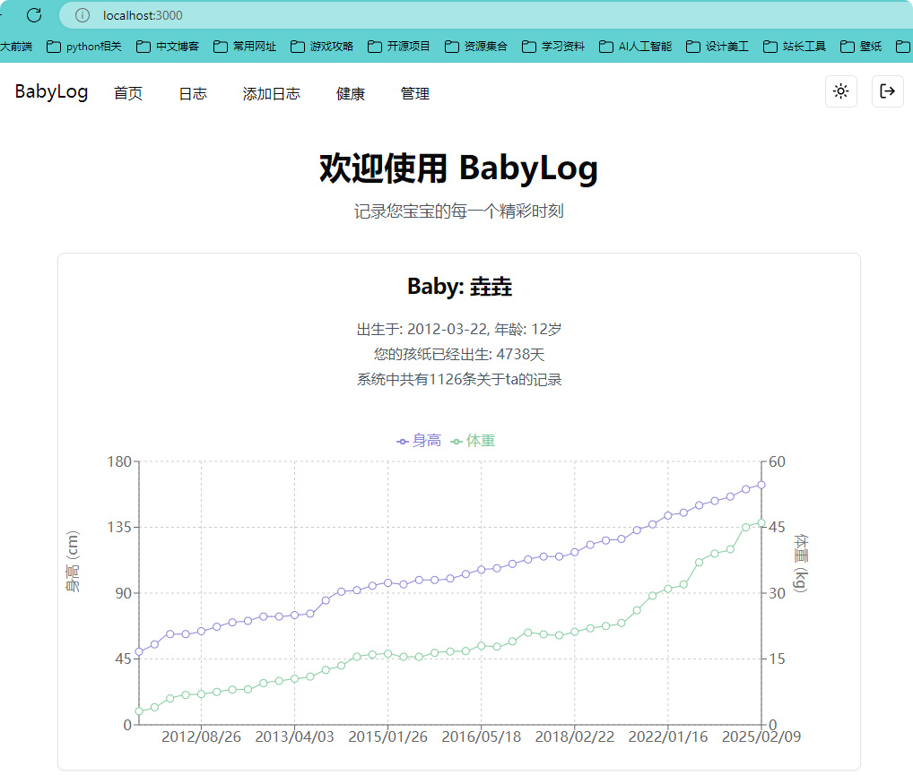
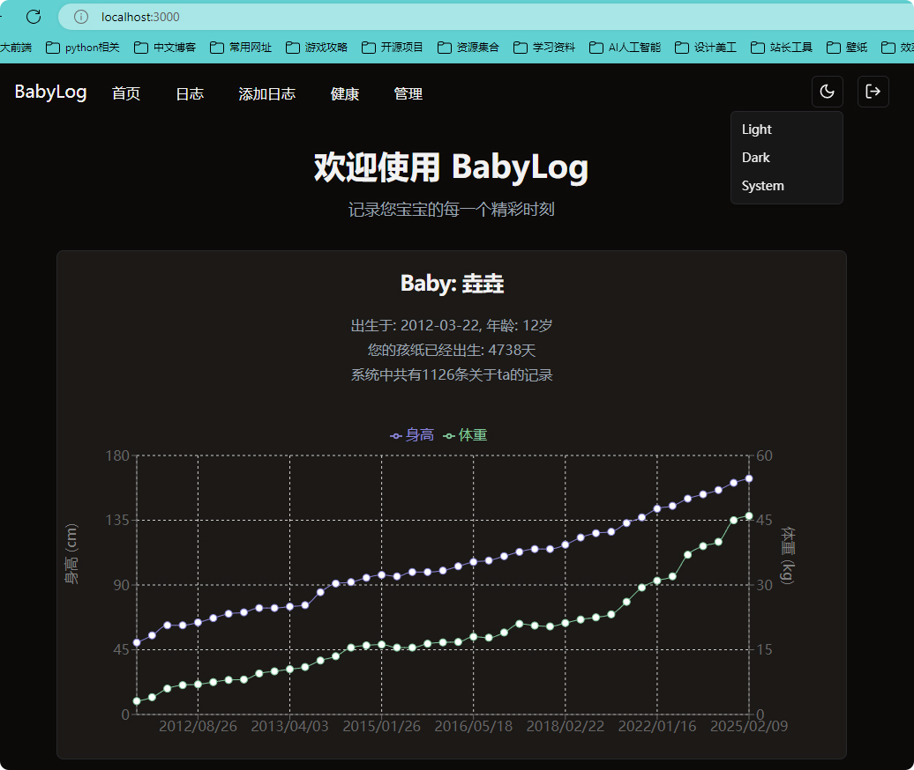
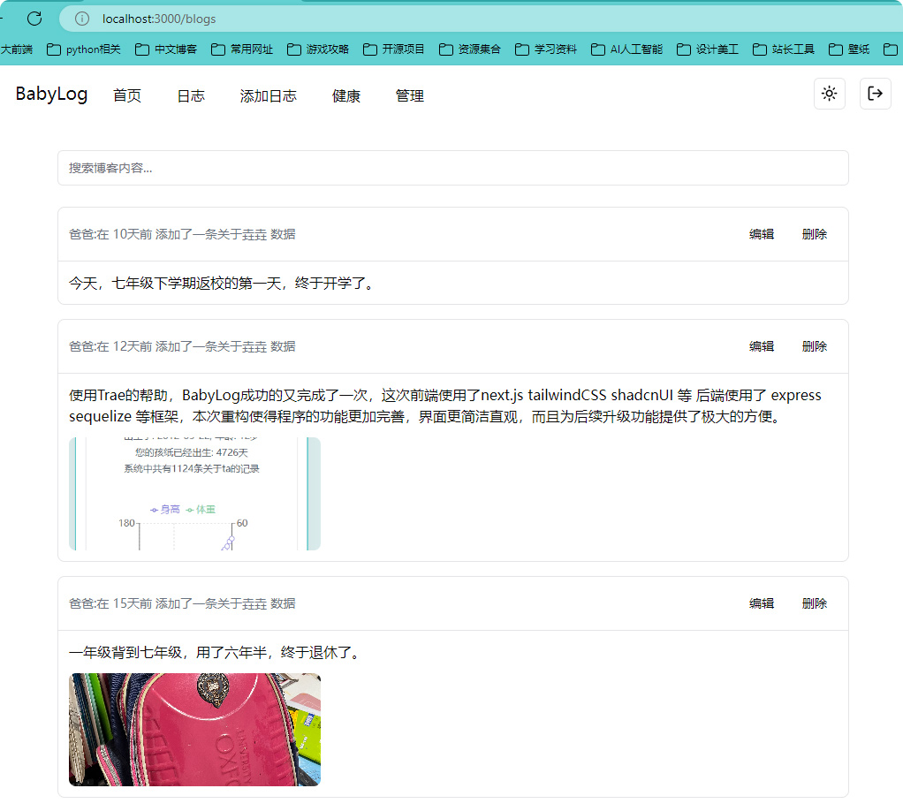
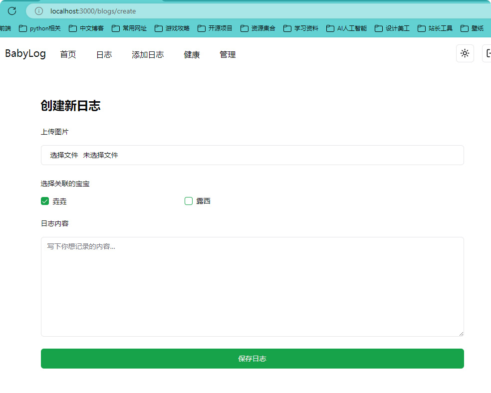
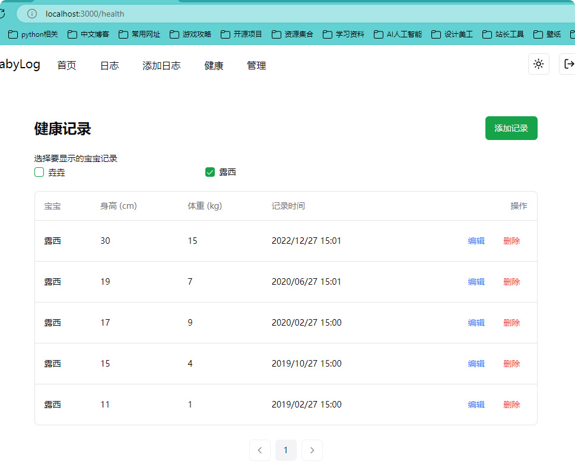
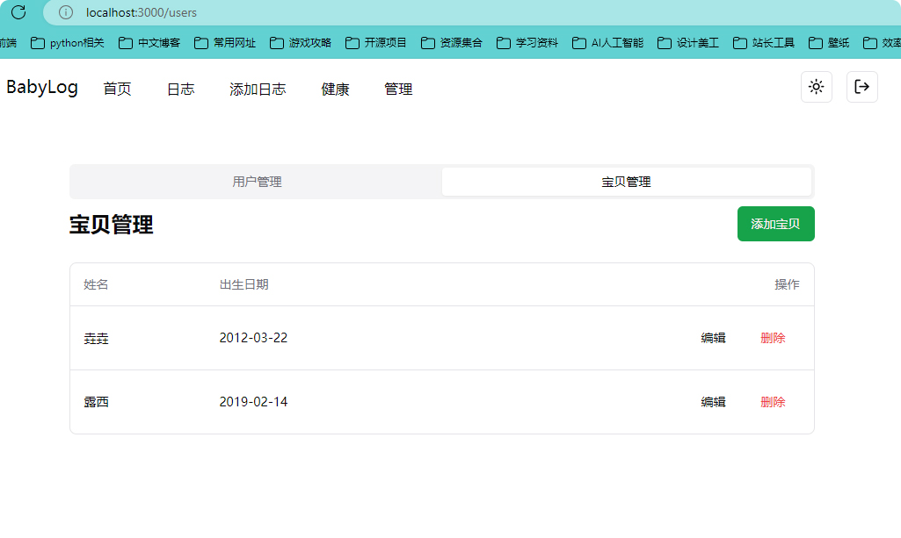

# BabyLog 3.0

岁月如风，唯有此忆, 任凭时光匆匆，记录点点滴滴。 

一晃12年都过去了,当初孩子出生的时候,我只是想记录一下一些当爸爸的心路历程,没想到一下子就过去了12年.

此间,程序重构过多次,但是唯一不变的就是那些记录下来的数据和相片.

全新的BabyLog3.0 发布了!


## 程序介绍

本程序采用现代化的前后端分离架构开发。
技术栈：
- 后端：Express.js、Sequelize、SQLite
- 前端：Next.js、Shadcn UI、Tailwind CSS

BabyLog是用来记录孩子成长过程的日记，那年今天,全文搜索等功能，还包括身高，体重，并使用图表展示,3.0系统支持多个宝贝.支持多位家长亲属共同记录.

## 视频演示

演示地址 :

https://www.bilibili.com/video/BV1kbXfYkEdm

## 界面预览



支持暗黑模式
















## 安装与部署

### 安装与启动

1. git克隆或是下载压缩包。

2. 一键安装所有依赖（前端和后端）：

    ```bash
    node install.js
    ```
3. 生产环境启动前必须构建前端：

    ```bash
    npm run build
    ```

    这个脚本会自动安装根目录、Express后端和Next.js前端的所有依赖。

4. 启动应用：

    生产环境启动：
    ```bash
    node start.js
    ```
    或
    ```bash
    npm start
    ```

    开发环境启动：
    ```bash
    node start.js --dev
    ```
    或
    ```bash
    npm run dev
    ```

    这将同时启动前端和后端服务：
    - 后端API服务运行在: http://localhost:8888
    - 前端开发服务运行在: http://localhost:3000


## 初始账号

首次启动程序,会创建管理员账号为：admin,密码为：123456.登录后在导航管理修改密码和个人资料。然后添加宝贝，添加其他家长，就可以开始记录了。


## OpenClaw 技能

本项目提供 OpenClaw 技能，让 AI 助手能够通过自然语言操作宝贝日记。

### 安装

将 `skills/babylog` 目录复制到 OpenClaw 的工作目录下：

```bash
cp -r skills/babylog ~/.openclaw/workspace/skills/
```

或者在 OpenClaw 中配置技能路径指向本项目。

### 使用

安装后，直接用自然语言与 OpenClaw 对话即可：

**添加日志**：
- "给露西添加日志，内容是今天露西很开心"
- "给垚垚和露西添加日志，内容是全家去公园玩"
- "给露西添加日志，内容是xxx。添加者是妈妈"

**搜索日志**：
- "返回最近10条日志"
- "返回露西最近10条日志"
- "给我5条关于露西的哭的日志"

**修改日志**：
- "把日志1184的内容全部替换成新内容"
- "修改日志1184，把"打原神"改成"打王者荣耀""
- "在日志1184后面追加，后来他们玩得很开心"

---

## 命令行脚本

也可以直接使用命令行脚本操作日志数据：

### 添加日志

```bash
python skills/babylog/scripts/add_blog.py --content "日志内容" --babies "露西" --author "爸爸"
```

参数：
- `--content, -c`：日志内容（必填）
- `--babies, -b`：宝宝名称，多个用逗号分隔（必填）
- `--author, -a`：添加者，家庭成员称呼，默认"爸爸"

### 搜索日志

```bash
# 最近10条日志
python skills/babylog/scripts/search_blog.py

# 最近20条日志
python skills/babylog/scripts/search_blog.py --limit 20

# 指定宝宝的日志
python skills/babylog/scripts/search_blog.py --baby "露西"

# 关键字搜索
python skills/babylog/scripts/search_blog.py --keyword "哭"

# 组合搜索
python skills/babylog/scripts/search_blog.py --baby "露西" --keyword "测试"
```

参数：
- `--limit, -l`：返回数量，默认10条
- `--baby, -b`：宝宝名称筛选
- `--keyword, -k`：关键字搜索

### 修改日志

```bash
# 全量替换
python skills/babylog/scripts/edit_blog.py --id 123 --replace "全新的内容"

# 部分替换（查找并替换）
python skills/babylog/scripts/edit_blog.py --id 123 --find "原内容" --replace "新内容"

# 追加内容
python skills/babylog/scripts/edit_blog.py --id 123 --append "追加的内容"

# 同时更新宝宝关联
python skills/babylog/scripts/edit_blog.py --id 123 --replace "新内容" --babies "露西,垚垚"
```

参数：
- `--id, -i`：日志ID（必填）
- `--replace, -r`：替换内容（全量替换或部分替换的新内容）
- `--find, -f`：查找内容（部分替换时使用）
- `--append, -a`：追加内容
- `--babies, -b`：新的宝宝关联，多个用逗号分隔（可选）

---

## 写在最后

这个程序自己真的是使用了好多年，历经几次的重构，从最开始的php原生代码到使用thinkPHP框架，后来有使用Java重构了一次（详见分支master），期间还用Python写了一个终端的录入版，而后使用了flask重构了一下，这次3.0版本使用前后端分离架构，采用Express.js作为后端、Next.js作为前端，使用了现代化的UI组件和响应式设计。这个程序使用也有12年多了，回头看看真是感慨万千，一方面是孩子的记录，一方面是自己学习的渣渣历程。

真诚的希望有孩子的和打算生孩子的程序员们来一起维护这个程序，有些东西真的需要记下来，不然回头看去都是模糊的回忆。

任凭时光匆匆，记录点点滴滴。以上记录与2025-03-01
   


